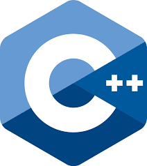

# Introduction to C++




### What is Programming ?

Programming is the process of instructions that tell a computer how to perform a task.

### Why Learn C++?

- C++ is used to develop games, desktop apps, operating systems, browsers, and so on.
- C++ Executes very fast.
- Rich Library support.
- Machine Independent & Platform Dependent language.
- C++ allows you to divide complex problems into smaller sets by using objects.

### What is C++ Programming?

- C++ was developed by **Bjarne Stroustrup** starting in **1979** at **Bell Labs** in **Murray Hill, New Jersey**.
- C++ is a general purpose, case-sensitive and object-oriented programming.
- C++ is a middle-level language as it is a combination of both high-level and low-level language features.
- C++ is a superset of C, that means any C program is a legal C++ program.

### Object-Oriented Programming

C++ supports Object-Oriented Programming, including the four pillars of Object-Oriented development.

- Encapsulation
- Data hiding
- Inheritance
- Polymorphism

**💻 Example 1 :**

```cpp
#include <iostream>

int main() {

    std::cout << "Hello world!";

    return 0;
}
```

**⚙️ Output :**

> Hello world!

### Program Explanation:

**Line 1:** `#` is a path provider.<br/> `include` is a directory/folder.<br/> `<iostream>` is a class. <br/>`<iostream>` stands for **Input Output Flow**.<br/>
_iOS is a combination of iostream, stream buffer and o stream_

**Line 2:** `int`(number) means Return type of your Function. <br/>`main()` it is a special function which is inbuilt.<br/> It is triggers automatically when program starts, it is the first function of every C++ program that is responsible for starting the execution and termination of the program.

**Line 2:** `{` is used to Start of the function.

**Line 3:** `std::cout<<"Hello world!";`<br/> `std` stands for standard namespace. `::` is a scope operator.<br/> `cout` stands for console out.<br/> `<<` is a function used to output print text to the screen or to flash out it is also called Insertion operator or left shift.<br/> The line `cout << "Hello world!";` causes the message "Hello World!" to be displayed on the screen.<br/>**`;`** semicolon used to terminate any statement.

**Line 4:** `return 0;` return 0 means that the program will execute successfully.

**Line 5:** `}` closing curly bracket is used to end the main function.

**💻 Program to used without 'using names space' :**

**💻 Example 2 :**

```c

#include <iostream>

int main() {

    std::cout << "Hello World";

    std::cout << "\nHello ABC!";

    return 0;
}
```

**⚙️ Output :**

> Hello World<br/>
> Hello ABC!

```cpp
#include <iostream>

int main() {

    std::cout << "Hello world!";

    return 0;
}
```

**⚙️ Output :**

> Hello world!

**💻 program :**

```cpp
#include <iostream>
using namespace std;

int main() {

    cout << "Hello world!";

    cout << "\n This is another text";

    return 0;
}
```

**⚙️ Output :**

> Hello world!<br/>
> This is another text
