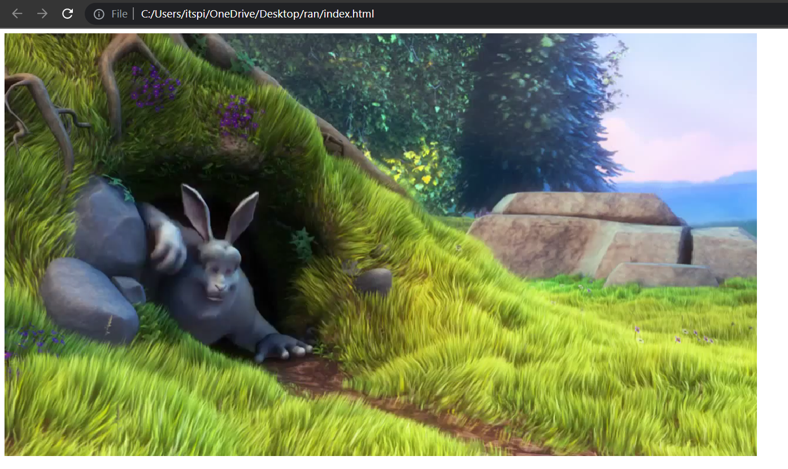
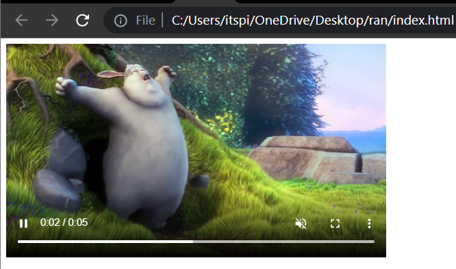

# Video Tag and Audio Tag

Video tag is used to show a video on web page in html.

**Syntax :**

```html
<video>
    <source src="<url>" type="video/mp4" />
</video>
```

**Example :**

```html
<!DOCTYPE html>
<html>
<head>
   <title>Video Tag</title>
</head>
<body>
   <video>
      <source src="./sample-video.mp4" type="video/mp4"/>
  </video>
</body>
</html>
```

**Output :**


### There are Some Attributes available for video tag 

1. Controls
2. Height
3. Width 
4. Autoplay
5. Muted
6. Poster 

### Controls

Controls attributes are used to show controls on video like Play, Pause, Volume, Fullscreen toggle.

### Height and Width

Height and Width Attribute are used to provide height and width for video.

**Example :**

```html
<!DOCTYPE html>
<html>
<head>
   <title>Video Tag</title>
</head>
<body>
   <video height="300px" controls autoplay>
      <source src="./sample-video.mp4" type="video/mp4" />
  </video>
</body>
</html>
```

**Output :**


### Auto Play

AutoPlay Attribute are used to the video will automatically start when you visit on webpage.

### Muted

The muted attribute specifies the audio of your video is muted.

**Example :**

```html
<!DOCTYPE html>
<html>
<head>
   <title>Video Tag</title>
</head>
<body>
   <video height="300px" controls autoplay muted>
      <source src="./sample-video.mp4" type="video/mp4" />
  </video>
</body>
</html>
```

**Output :**



### Poster 

The poster attribute are used to show image to your video. 

**Example :**

```html
<!DOCTYPE html>
<html>
<head>
   <title>Video Tag</title>
</head>
<body>
   <video height="300px" poster="./bulb-on.png" controls >
      <source src="./sample-video.mp4" type="video/mp4" />
  </video>
</body>
</html>
```

**Output :**


### Audio Tag

Audio tag is used to show a audio on web page in html.

**Syntax :**

```html
<audio>
    <source src="<url>" type="audio/mp3" />
</audio>
```

**Example :**

```html
<!DOCTYPE html>
<html>
<head>
   <title>Audio Tag</title>
</head>
<body>
   <audio controls>
      <source src="sample-audio.mp3" type="audio/mp4" />
  </audio>
</body>
</html>
```

**Output :**


**Example :**

```html
<!DOCTYPE html>
<html>
<head>
   <title>Audio Tag</title>
</head>
<body>
   <audio controls muted autoplay>
      <source src="sample-audio.mp3" type="audio/mp4" />
  </audio>
</body>
</html>
```

**Output :**


### 🔊▶️ Audio and Video URLs

You can use these URLs directly for the src attribute. For example  src="url" 

For audio: 
https://freetestdata.com/wp-content/uploads/2021/09/Free_Test_Data_500KB_MP3.mp3

For video:
https://commondatastorage.googleapis.com/gtv-videos-bucket/sample/BigBuckBunny.mp4
